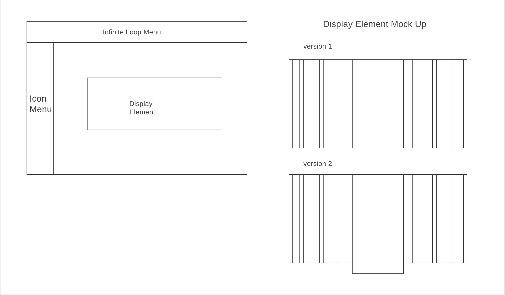

# fashiontrends
Functionality of my project, Art and Trends, is to visualize image data. My main functionality is to have the user interact with an array of pictures that expand where the user is hovering.

__In Fashion and Trends, users will be able to:__

-Scrolling and and enlarging while mouse is hovering over a picture

-Abstraction of image set to move past on top bar

-A menu to access each page

In addition, this project will include:

Production README

__Wireframes:__

__Technologies, Libraries, APIs:__

~~Tumblr API~~
D3 JS
HARVARD Museum API
MET Museum API
CLEVELAND Museum API
BROOKLYN Museum API
CHICAGO Museum API

__Implementation Timeline:__

__Friday Afternoon & Weekend:__
Friday and the weekend will be to nail down the visual layout of my project. I would like my html, css and static elements as finalized as possible before I move onto problem solving the dynamic elements. I will also create and Art Object class to make them uniform in attributes, if I am pulling them from different APIs.
The goal over the weekend is to familiarize myself with new tools, mainly D3 to try and a get a start of the mockup of the main hovering scroll feature of the project.
 

***Monday:***
Continue working on my main feature as well as figure out to to make a moving top nav bar. 

***Tuesday:***
Continue and try to finalize main visualizer. Start the abstracted static images to move through top bar.

***Wednesday:***
Finalization of everything and if everything is smooth, starting on bonus quick sort like feature.

***Thursday Morning:***
Polishing everything and full testing for presentations.

__BONUS:__

-Quick sort like functionality when a picture is clicked other pictures are moved left or right according to date.

